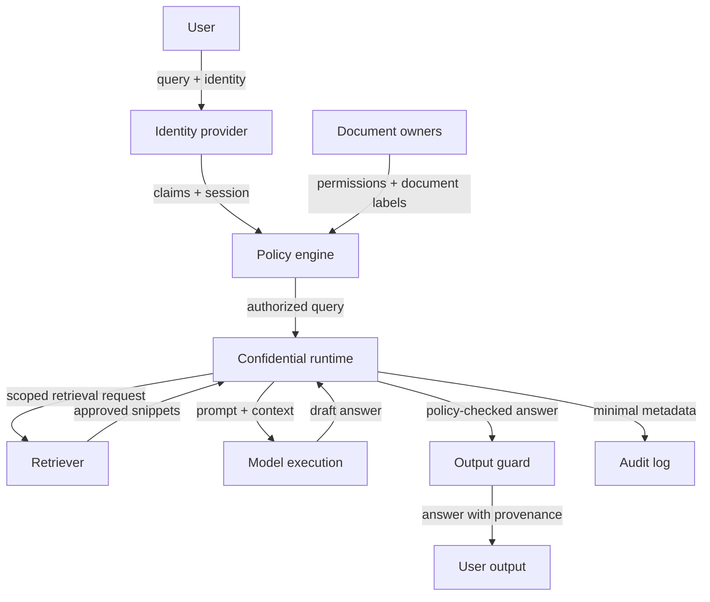

# Confidential RAG

## Goal

Answer questions over sensitive documents while reducing exposure of queries, retrieved context, and generated outputs.

## Actors

User, identity provider, policy engine, retriever, confidential runtime, language model, document owner, platform operator, and auditor.

## Data Flow

## Trust Boundaries

| Boundary | What crosses | Who can see it | Risk |
| --- | --- | --- | --- |
| User to identity/policy | Query, identity, purpose | Identity and policy services | Sensitive prompts and user intent |
| Document owners to policy | Permissions and labels | Policy service | Stale or overbroad authorization |
| Policy to runtime | Authorized query | Confidential runtime | Incorrect permissions |
| Runtime to retriever | Scoped retrieval request | Retriever owner | Cross-repository interest leakage |
| Retriever to runtime | Snippets and metadata | Confidential runtime | Overbroad retrieval |
| Runtime to output guard | Draft answer and citations | Output policy | Restricted content may be quoted |
| Runtime to logs | Metadata and errors | Operators, auditors | Prompt or snippet leakage |
| Output guard to user | Answer and citations | User | Restricted content revealed in output |

## Assumptions

- Users and document permissions are current.
- Remote attestation is verified by the party relying on confidential execution.
- Logs exclude prompts and snippets unless explicitly allowed.
- Output policy is enforced before answers leave the runtime.

## Assumption Review

| Assumption | How to validate | If it fails |
| --- | --- | --- |
| Permissions are current | Test document lifecycle, group sync, and revoked access | Retrieval can expose documents the user should not see |
| Attestation is verified | Check client or gateway policy against expected measurements | Confidential-computing claims become unverifiable |
| Logs are minimized | Inspect traces, support bundles, prompt stores, and analytics | The protected prompt/context leaks outside the runtime |
| Output guard is effective | Run expected-deny, quote-leakage, and prompt-injection tests | The answer reveals restricted content even when retrieval was scoped |

## PET Stack

TEEs, remote attestation, access control, query minimization, redaction, logging controls, provenance, and output policy.

## Common PET Combinations

| Add | Use when | New risk |
| --- | --- | --- |
| Differential privacy | Aggregate analytics over RAG usage or document access are published | Utility loss and budget accounting |
| Redaction/minimization | Prompts or snippets contain secrets not needed for the answer | Redaction misses context or harms answer quality |
| Segmented retrieval | Document domains have different sensitivity or owners | More policy complexity and recall risk |
| HE or local inference | The model host must not see selected inference inputs | Limited model support or client-device constraints |

## What This Does Not Protect Against

- Incorrect document permissions.
- Prompt injection in retrieved documents.
- Sensitive facts revealed by allowed answers.
- Hallucinations or unsupported advice.
- Side channels beyond the stated TEE assumptions.

Out of scope unless explicitly added: malicious document owners, full prompt
injection defense, model hallucination safety, endpoint compromise, and side
channels outside the selected confidential-computing platform.

## Deployment Notes

Bind attestation to model code and retrieval policy. Keep provenance visible, minimize prompt logging, and test denied-access cases continuously.

## Tradeoffs

Confidential computing improves runtime protection but does not solve authorization, hallucination, output leakage, or bad retrieval policy.

## Failure Modes

Cross-tenant retrieval, leaked prompts, overbroad snippets, plaintext logs, weak attestation UX, unreviewed generated answers, and citations that reveal restricted document existence.

## Evaluation Checklist

- Can every snippet be traced to an authorization decision?
- Are denied retrievals tested?
- Are prompt injection fixtures included?
- Do logs exclude prompts, snippets, and sensitive answers?
- Can clients or auditors verify attestation?
