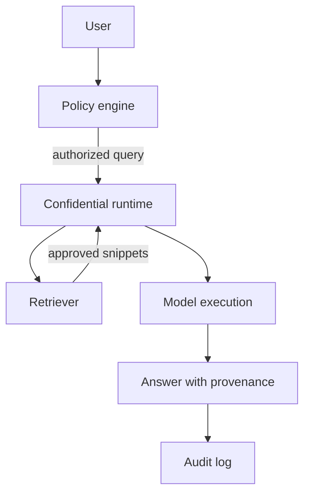

# Confidential RAG

## Goal

Answer questions over sensitive documents while reducing exposure of queries, retrieved context, and generated outputs.

## Actors

User, policy engine, retriever, confidential runtime, language model, document owner, and auditor.

## Data Flow

## Trust Boundaries

Document stores, retrieval infrastructure, model execution, logs, and users are separate trust zones.

## PET Stack

TEEs, remote attestation, access control, query minimization, redaction, logging controls, and output policy.

## Deployment Notes

Bind attestation to model code and retrieval policy. Keep provenance visible and minimize prompt logging.

## Tradeoffs

Confidential computing improves runtime protection but does not solve authorization, hallucination, or output leakage.

## Failure Modes

Cross-tenant retrieval, leaked prompts, overbroad snippets, plaintext logs, weak attestation UX, and unreviewed generated answers.
