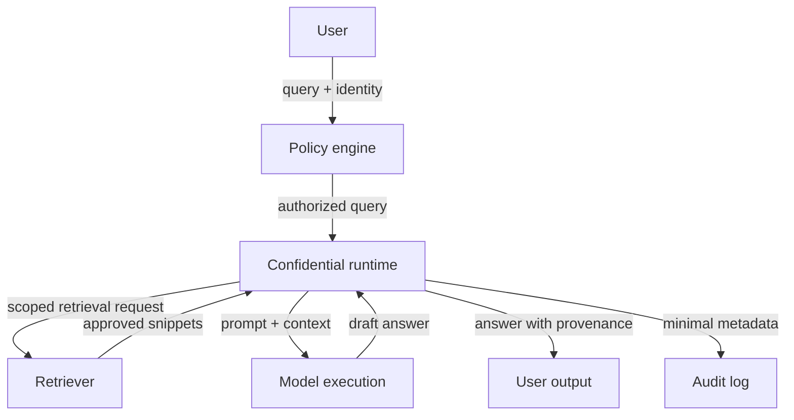

# Confidential RAG

## Goal

Answer questions over sensitive documents while reducing exposure of queries, retrieved context, and generated outputs.

## Actors

User, identity provider, policy engine, retriever, confidential runtime, language model, document owner, platform operator, and auditor.

## Data Flow

## Trust Boundaries

| Boundary | What crosses | Who can see it | Risk |
| --- | --- | --- | --- |
| User to policy | Query, identity, purpose | Policy service | Sensitive prompts and user intent |
| Policy to runtime | Authorized query | Confidential runtime | Incorrect permissions |
| Runtime to retriever | Scoped retrieval request | Retriever owner | Cross-repository interest leakage |
| Retriever to runtime | Snippets and metadata | Confidential runtime | Overbroad retrieval |
| Runtime to logs | Metadata and errors | Operators, auditors | Prompt or snippet leakage |
| Runtime to user | Answer and citations | User | Restricted content revealed in output |

## Assumptions

- Users and document permissions are current.
- Remote attestation is verified by the party relying on confidential execution.
- Logs exclude prompts and snippets unless explicitly allowed.
- Output policy is enforced before answers leave the runtime.

## PET Stack

TEEs, remote attestation, access control, query minimization, redaction, logging controls, provenance, and output policy.

## What This Does Not Protect Against

- Incorrect document permissions.
- Prompt injection in retrieved documents.
- Sensitive facts revealed by allowed answers.
- Hallucinations or unsupported advice.
- Side channels beyond the stated TEE assumptions.

## Deployment Notes

Bind attestation to model code and retrieval policy. Keep provenance visible, minimize prompt logging, and test denied-access cases continuously.

## Tradeoffs

Confidential computing improves runtime protection but does not solve authorization, hallucination, output leakage, or bad retrieval policy.

## Failure Modes

Cross-tenant retrieval, leaked prompts, overbroad snippets, plaintext logs, weak attestation UX, unreviewed generated answers, and citations that reveal restricted document existence.

## Evaluation Checklist

- Can every snippet be traced to an authorization decision?
- Are denied retrievals tested?
- Are prompt injection fixtures included?
- Do logs exclude prompts, snippets, and sensitive answers?
- Can clients or auditors verify attestation?
