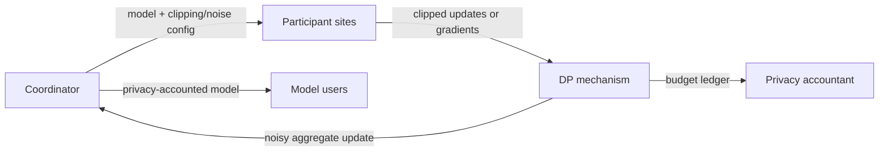

# FL + Differential Privacy

## Goal

Train a shared model while bounding the influence of a privacy unit on the released model.

## Actors

Participants, coordinator, model owner, privacy accountant, auditors, and model users.

## Data Flow

## Trust Boundaries

| Boundary | What crosses | Who can see it | Risk |
| --- | --- | --- | --- |
| Coordinator to sites | Model, code, DP parameters | Sites | Misconfigured clipping or noise |
| Sites to DP mechanism | Updates or gradients | DP mechanism / coordinator depending on design | Update leakage before noise |
| DP mechanism to accountant | Privacy events | Privacy accountant | Incorrect composition accounting |
| Coordinator to users | Final model | Model users | Memorization if DP assumptions fail |

## Assumptions

- The privacy unit is defined before training.
- Clipping, sampling, and accounting match the actual training process.
- Every release is included in composition accounting.
- Utility is evaluated under the chosen budget, not after relaxing it.

## PET Stack

Federated learning, DP-SGD or noisy aggregate updates, privacy accounting, optional secure aggregation, and model auditing.

## What This Does Not Protect Against

- Poorly defined privacy units.
- Unaccounted releases or repeated experiments.
- Poisoning by malicious participants.
- Utility harm to underrepresented sites.
- Logs or checkpoints outside the DP mechanism.

## Deployment Notes

Keep a budget ledger, bind DP parameters to training runs, and document failed tuning attempts when they consume privacy budget.

## Tradeoffs

DP provides a formal output guarantee, but it can reduce utility and make training harder to tune.

## Failure Modes

Arbitrary epsilon choices, untracked composition, clipping that destroys utility, non-private checkpoints, and claims that omit the privacy unit.

## Evaluation Checklist

- What is the privacy unit?
- What epsilon/delta and accounting method are used?
- Are all releases and tuning runs accounted for?
- Does utility hold for small sites and subgroups?
- Are checkpoints, logs, and metrics covered by release policy?

## References

- Dwork and Roth, [*The Algorithmic Foundations of Differential Privacy*](https://www.cis.upenn.edu/~aaroth/Papers/privacybook.pdf), 2014.
- NIST, [*Guidelines for Evaluating Differential Privacy Guarantees*](https://doi.org/10.6028/NIST.SP.800-226), SP 800-226, 2025.
