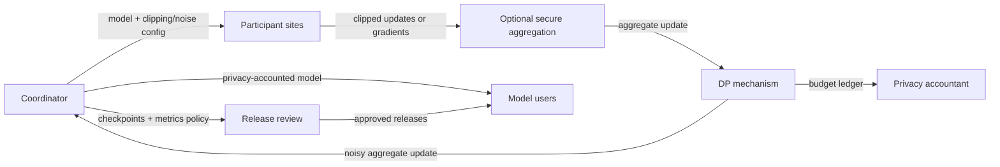

# FL + Differential Privacy

## Goal

Train a shared model while bounding the influence of a privacy unit on the released model.

## Actors

Participants, coordinator, model owner, privacy accountant, auditors, and model users.

## Data Flow

## Trust Boundaries

| Boundary | What crosses | Who can see it | Risk |
| --- | --- | --- | --- |
| Coordinator to sites | Model, code, DP parameters | Sites | Misconfigured clipping or noise |
| Sites to DP mechanism | Updates or gradients | DP mechanism / coordinator depending on design | Update leakage before noise |
| DP mechanism to accountant | Privacy events | Privacy accountant | Incorrect composition accounting |
| Coordinator to release review | Checkpoints, metrics, model candidates | Reviewers | Unaccounted releases can bypass DP claim |
| Coordinator to users | Final model | Model users | Memorization if DP assumptions fail |

## Assumptions

- The privacy unit is defined before training.
- Clipping, sampling, and accounting match the actual training process.
- Every release is included in composition accounting.
- Utility is evaluated under the chosen budget, not after relaxing it.

## Assumption Review

| Assumption | How to validate | If it fails |
| --- | --- | --- |
| Privacy unit is stable | Write the unit in the training spec and review neighboring datasets | The DP claim may protect the wrong person, device, site, or event |
| Accounting matches implementation | Reconcile run logs, sampling, clipping, and releases with the accountant | Epsilon/delta no longer describe the actual release |
| Tuning is accounted for | Track failed runs, candidate models, and auxiliary metrics | Utility pressure can spend privacy budget invisibly |
| Subgroup utility is acceptable | Evaluate sites and rare groups before release | A formally private model may be unusable for the people who need it |

## PET Stack

Federated learning, DP-SGD or noisy aggregate updates, privacy accounting, optional secure aggregation, and model auditing.

## Common PET Combinations

| Add | Use when | New risk |
| --- | --- | --- |
| Secure aggregation | Coordinator should not see individual updates before DP noise | Harder debugging and poisoning detection |
| Robust aggregation | Malicious or compromised sites are plausible | May conflict with DP clipping and secure aggregation |
| Confidential training | Training infrastructure is outside the main trust boundary | Attestation and hardware trust become part of the claim |
| Release governance | Multiple models, metrics, or synthetic artifacts are emitted | Requires a complete release ledger |

## What This Does Not Protect Against

- Poorly defined privacy units.
- Unaccounted releases or repeated experiments.
- Poisoning by malicious participants.
- Utility harm to underrepresented sites.
- Logs or checkpoints outside the DP mechanism.

Out of scope unless explicitly added: poisoning by participants, leakage before
the DP mechanism, side channels from local training, and downstream misuse of the
released model.

## Deployment Notes

Keep a budget ledger, bind DP parameters to training runs, and document failed tuning attempts when they consume privacy budget.

## Tradeoffs

DP provides a formal output guarantee, but it can reduce utility and make training harder to tune.

## Failure Modes

Arbitrary epsilon choices, untracked composition, clipping that destroys utility, non-private checkpoints, and claims that omit the privacy unit.

## Evaluation Checklist

- What is the privacy unit?
- What epsilon/delta and accounting method are used?
- Are all releases and tuning runs accounted for?
- Does utility hold for small sites and subgroups?
- Are checkpoints, logs, and metrics covered by release policy?
