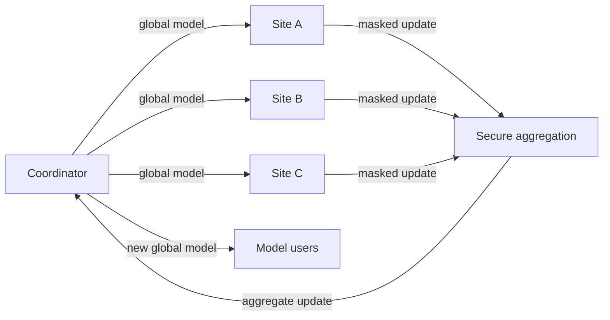

# FL + Secure Aggregation

## Goal

Train a shared model while hiding individual participant updates from the coordinator.

## Actors

Participants, coordinator, model owner, auditors, and downstream model users.

## Data Flow

## Trust Boundaries

Raw data stays inside sites. The coordinator sees only aggregate updates if threshold assumptions hold.

## PET Stack

Federated learning, secure aggregation, participant authentication, optional DP, and model auditing.

## Deployment Notes

Plan for participant dropouts, versioned training code, reproducible evaluation, and secure key setup.

## Tradeoffs

Secure aggregation improves update privacy but makes debugging, anomaly detection, and malicious-client handling harder.

## Failure Modes

Gradient leakage without aggregation, poisoning, small participant rounds, key setup errors, and weak participant identity.
