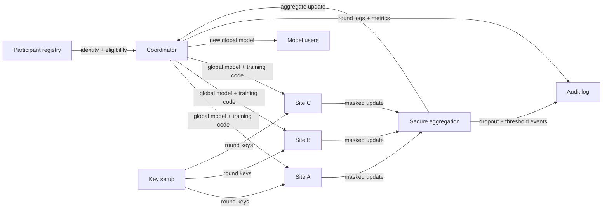

# FL + Secure Aggregation

## Goal

Train a shared model while hiding individual participant updates from the coordinator.

## Actors

Participants, coordinator, model owner, secure-aggregation service, auditors, and downstream model users.

## Data Flow

## Trust Boundaries

| Boundary | What crosses | Who can see it | Risk |
| --- | --- | --- | --- |
| Site to coordinator | Training code, model version, round instructions | Site operators, coordinator | Bad code or wrong model version |
| Site to aggregation | Masked updates and metadata | Aggregation service | Update leakage if threshold/key assumptions fail |
| Aggregation to coordinator | Aggregate update | Coordinator | Small rounds can expose participants |
| Coordinator to users | Final model | Model users | Memorization and membership inference |
| System to logs | Metrics, errors, round metadata | Operators, auditors | Logs can reveal participant behavior |

## Assumptions

- Enough participants complete each round to satisfy secure-aggregation thresholds.
- Participant identity and key setup are reliable.
- Local training code is reviewed and versioned.
- The coordinator cannot inspect individual unmasked updates.

## Assumption Review

| Assumption | How to validate | If it fails |
| --- | --- | --- |
| Round threshold is large enough | Simulate dropouts and small-site participation | Aggregate updates can expose a site or force skipped rounds |
| Participant identity is reliable | Bind sites to keys, certificates, and round eligibility | A fake or compromised participant can poison or observe protocol behavior |
| Training code is controlled | Version code, configs, and model hashes per round | Sites may train incompatible or malicious updates |
| Logs are minimized | Review round metadata, errors, and support bundles | Metadata can reveal participation, timing, or site behavior |

## PET Stack

Federated learning, secure aggregation, participant authentication, optional DP, robust aggregation, and model auditing.

## Common PET Combinations

| Add | Use when | New risk |
| --- | --- | --- |
| Differential privacy | The released model needs record-level or patient-level contribution bounds | Utility loss and accounting complexity |
| Robust aggregation | Participants may be malicious or compromised | Harder to combine with hidden individual updates |
| TEEs for orchestration | Coordinator code should be constrained by attestation | Hardware trust and side-channel assumptions |
| Output review | Final model or metrics may leak membership | Requires release gates and model-audit ownership |

## What This Does Not Protect Against

- Poisoned updates by malicious participants.
- Leakage from the final model.
- Weak local security at participant sites.
- Small-round inference.
- Debug logs that expose update metadata.

Out of scope unless explicitly added: malicious-secure training, compromised local
data systems, model extraction by downstream users, and side-channel leakage from
participant infrastructure.

## Deployment Notes

Plan for participant dropouts, versioned training code, reproducible evaluation, secure key setup, and rollback when aggregation fails.

## Tradeoffs

Secure aggregation improves update privacy but makes debugging, anomaly detection, and malicious-client handling harder.

## Failure Modes

Gradient leakage without aggregation, poisoning, small participant rounds, key setup errors, weak participant identity, and plaintext operational logs.

## Evaluation Checklist

- What minimum number of participants is required per round?
- Are update sizes, timing, and dropouts logged safely?
- Is the final model tested for memorization?
- Can poisoning be detected without inspecting individual updates?
- Is the key setup recoverable after participant failure?
