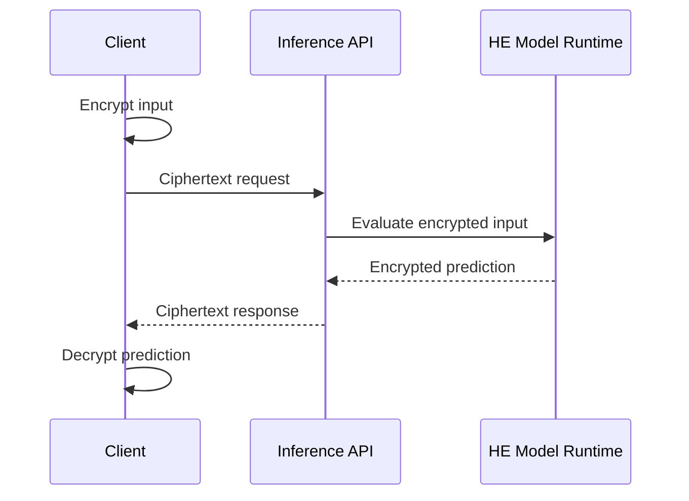

# HE Private Inference API

## Goal

Let clients receive predictions without exposing plaintext inputs to the model service.

## Actors

Client, model service, key holder, model owner, and monitor.

## Data Flow

## Trust Boundaries

The service handles ciphertexts and should not access client plaintext or decryption keys.

## PET Stack

Homomorphic encryption, model quantization, batching, ciphertext parameter management, and client-side key handling.

## Deployment Notes

Design the model for HE constraints. Measure latency, ciphertext size, and precision loss before committing.

## Tradeoffs

Strong input confidentiality comes with cost, limited operations, and a smaller model design space.

## Failure Modes

Unsupported model layers, insecure key storage, parameter mistakes, output leakage, and unacceptable latency.
