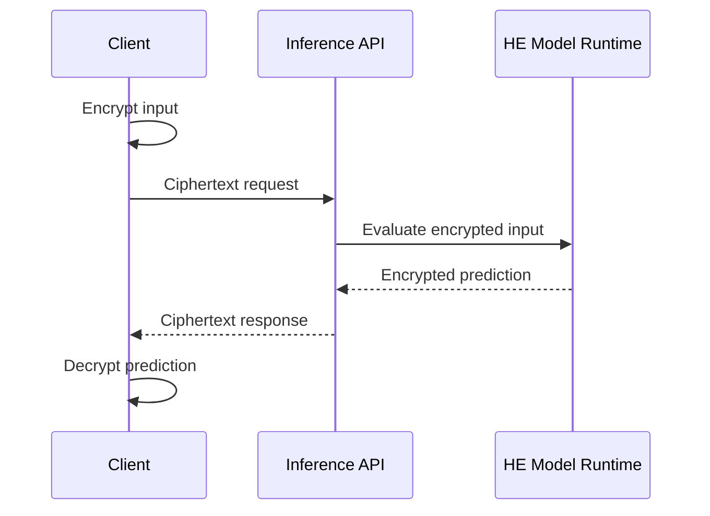

# HE Private Inference API

## Goal

Let clients receive predictions without exposing plaintext inputs to the model service.

## Actors

Client, model service, HE model runtime, key holder, model owner, platform operator, and monitor.

## Data Flow

## Trust Boundaries

| Boundary | What crosses | Who can see it | Risk |
| --- | --- | --- | --- |
| Client to API | Ciphertext and metadata | API, platform operator | Metadata leakage |
| API to HE runtime | Ciphertext request | Model service | Parameter or operator mistakes |
| Runtime to client | Encrypted prediction | Client | Prediction may still reveal sensitive facts |
| Client local boundary | Plaintext input and output | Client | Weak key or output handling |

## Assumptions

- The service never receives decryption keys.
- HE parameters are reviewed for security and correctness.
- The model architecture fits supported operations.
- Metadata and outputs are included in privacy review.

## PET Stack

Homomorphic encryption, model quantization, batching, ciphertext parameter management, client-side key handling, and output monitoring.

## What This Does Not Protect Against

- Output leakage through predictions.
- Client-side key compromise.
- Model extraction by clients.
- Unsupported operations approximated poorly.
- Traffic metadata and request timing leakage.

## Deployment Notes

Design the model for HE constraints. Measure latency, ciphertext size, accuracy loss, and cloud cost before committing.

## Tradeoffs

Strong input confidentiality comes with cost, limited operations, approximation constraints, and a smaller model design space.

## Failure Modes

Unsupported model layers, insecure key storage, parameter mistakes, output leakage, unacceptable latency, and unreadable debugging traces.

## Evaluation Checklist

- Does the model fit HE-supported operators?
- What is end-to-end p95 latency?
- What accuracy is lost versus plaintext inference?
- Who controls keys?
- Are output and metadata leakage reviewed?
