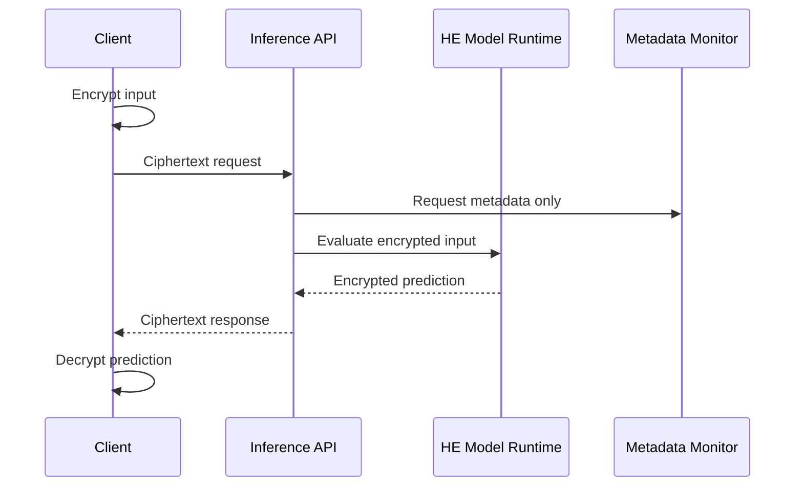

# HE Private Inference API

## Decision framing

| Field | Scope |
| --- | --- |
| Protected asset | Client inputs evaluated as ciphertext by the model service. |
| Adversary | A model service or platform operator without decryption keys. |
| Allowed output | Encrypted predictions returned to the client for local decryption. See [allowed output](../start-here/glossary.md#allowed-output). |
| Leakage surface | Request timing, sizes, tenant metadata, client-side plaintext, and information in decrypted predictions. See [leakage](../start-here/glossary.md#leakage). |
| Assumptions | Reviewed HE parameters and supported model operations; the service never receives decryption keys; see the assumption review below. |
| Non-goals | Model secrecy from clients, verifiable computation, client-device security, or hiding all traffic metadata. |

--8<-- "decision-guidance.md"

## Goal

Let clients receive predictions without exposing plaintext inputs to the model service.

## Actors

Client, model service, HE model runtime, key holder, model owner, platform operator, and monitor.

## Data Flow

```mermaid
sequenceDiagram
  participant Client
  participant API as Inference API
  participant Model as HE Model Runtime
  participant Monitor as Metadata Monitor
  Client->>Client: Encrypt input
  Client->>API: Ciphertext request
  API->>Monitor: Request metadata only
  API->>Model: Evaluate encrypted input
  Model-->>API: Encrypted prediction
  API-->>Client: Ciphertext response
  Client->>Client: Decrypt prediction
```

On small screens, scroll the diagram horizontally to read the labels.

## Trust Boundaries

| Boundary | What crosses | Who can see it | Risk |
| --- | --- | --- | --- |
| Client to API | Ciphertext and metadata | API, platform operator | Metadata leakage |
| API to HE runtime | Ciphertext request | Model service | Parameter or operator mistakes |
| Runtime to client | Encrypted prediction | Client | Prediction may still reveal sensitive facts |
| Client local boundary | Plaintext input and output | Client | Weak key or output handling |
| API to monitoring | Timing, size, status, tenant metadata | Operators | Metadata can reveal sensitive usage patterns |

## Assumptions

- The service never receives decryption keys.
- HE parameters are reviewed for security and correctness.
- The model architecture fits supported operations.
- Metadata and outputs are included in privacy review.

## Assumption Review

| Assumption | How to validate | If it fails |
| --- | --- | --- |
| Model fits HE constraints | Run operator, accuracy, ciphertext-size, and latency benchmarks | The team may ship a weak model or miss the latency budget |
| Service lacks decryption keys | Review key lifecycle and client SDK behavior | Input confidentiality collapses to ordinary hosted inference |
| Metadata is acceptable | Inspect timing, size, tenant, and error logs | The service may infer sensitive behavior without plaintext |
| Output handling is safe | Review client-side storage, display, and downstream use | Predictions can leak sensitive attributes after decryption |

## PET Stack

[Homomorphic encryption](../start-here/glossary.md#homomorphic-encryption), model quantization, batching, ciphertext parameter management, client-side key handling, and output monitoring.

## Common PET Combinations

| Add | Use when | New risk |
| --- | --- | --- |
| TEE runtime | Some preprocessing or unsupported model layer cannot run efficiently under HE | Hardware trust and plaintext inside the enclave |
| Client-side inference | The model can run locally and IP exposure is acceptable | Model extraction and device support |
| Output policy | Predictions are themselves sensitive | Application governance becomes part of the privacy claim |
| Rate limiting | Repeated queries can extract model behavior or sensitive outputs | Abuse controls may reveal usage metadata |

## Does not protect

- Output leakage through predictions.
- Client-side key compromise.
- Model extraction by clients.
- Unsupported operations approximated poorly.
- Traffic metadata and request timing leakage.

Out of scope unless explicitly added: model confidentiality from clients, client
device compromise, side-channel leakage through traffic analysis, and attacks on
the decrypted prediction after delivery.

## Deployment Notes

Design the model for HE constraints. Measure latency, ciphertext size, accuracy loss, and cloud cost before committing.

## Tradeoffs

Strong input confidentiality comes with cost, limited operations, approximation constraints, and a smaller model design space.

## Failure modes

Unsupported model layers, insecure key storage, parameter mistakes, output leakage, unacceptable latency, and unreadable debugging traces.

## Evaluation Checklist

- Does the model fit HE-supported operators?
- What is end-to-end p95 latency?
- What accuracy is lost versus plaintext inference?
- Who controls keys?
- Are output and metadata leakage reviewed?
