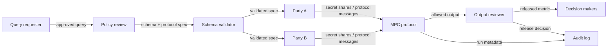

# MPC Analytics Pipeline

## Goal

Compute a joint analytic result across parties without revealing each party's raw inputs to a central processor.

## Actors

Data-contributing parties, protocol participants, query requester, output reviewer, auditors, and downstream decision makers.

## Data Flow

## Trust Boundaries

| Boundary | What crosses | Who can see it | Risk |
| --- | --- | --- | --- |
| Requester to review | Query and intended output | Reviewers | Query may be too revealing |
| Parties to protocol | Shares and protocol messages | Protocol parties | Collusion or malformed inputs |
| Protocol to reviewer | Computed output | Reviewer | Output leakage |
| Reviewer to users | Released metric | Decision makers | Misuse or overinterpretation |
| Protocol to audit log | Run metadata and release decisions | Auditors | Logs can reveal participation or query patterns |

## Assumptions

- Collusion threshold is explicit.
- Parties authenticate each other and run the agreed protocol.
- Output policy is defined before computation.
- Malformed inputs are validated or handled.

## Assumption Review

| Assumption | How to validate | If it fails |
| --- | --- | --- |
| Collusion threshold is realistic | Compare protocol threshold to ownership, hosting, and incentives | Inputs can be reconstructed by parties treated as separate |
| Output policy is enforceable | Review examples of allowed, suppressed, and rejected outputs | MPC computes a private input function whose result still leaks |
| Parties are available | Test retries, timeouts, and participant dropout behavior | Latency and aborts can make the workflow unusable or revealing |
| Schemas match | Validate definitions, units, identifiers, and missing values | The result may be wrong even if the protocol is secure |

## PET Stack

MPC, participant authentication, schema validation, query approval, output thresholding, optional DP, and audit logging.

## Common PET Combinations

| Add | Use when | New risk |
| --- | --- | --- |
| Differential privacy | Aggregate output can reveal small cohorts or repeated-query differences | Utility loss and budget accounting |
| PSI | The workflow starts with entity overlap | The match set may be sensitive |
| Clean-room workflow | Analysts need governed query submission and review | Platform trust and policy bypasses |
| TEEs | Protocol coordination or preprocessing needs confidential execution | Hardware trust and attestation |

## What This Does Not Protect Against

- Outputs that reveal sensitive facts.
- Collusion beyond the stated threshold.
- Malicious inputs if the protocol is only semi-honest.
- Poor schema alignment.
- Operational metadata leakage.

Out of scope unless explicitly added: malicious security, denial of service by a
party, side channels in protocol implementations, and misuse of released metrics.

## Deployment Notes

Estimate rounds, bandwidth, availability requirements, and failure behavior before committing to the protocol.

## Tradeoffs

MPC reduces reliance on one trusted processor but increases protocol, networking, debugging, and participant-coordination complexity.

## Failure Modes

Unrealistic collusion assumptions, high latency, participant unavailability, malformed inputs, tiny-cohort outputs, and opaque cost.

## Evaluation Checklist

- What collusion threshold is claimed?
- Is malicious security required?
- What outputs are allowed or suppressed?
- How are schemas validated?
- What happens when a party drops out?
