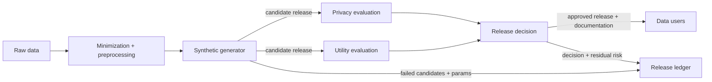

# Synthetic Data Release Pipeline

## Goal

Release data-like artifacts while reducing privacy risk and preserving enough utility for intended downstream tasks.

## Actors

Data owner, synthetic-data generator, privacy reviewer, utility evaluator, release approver, data users, and auditor.

## Data Flow

## Trust Boundaries

| Boundary | What crosses | Who can see it | Risk |
| --- | --- | --- | --- |
| Raw data to preprocessing | Sensitive records | Data owner, processor | Unnecessary sensitive fields retained |
| Generator to evaluators | Synthetic candidates | Privacy and utility reviewers | Candidate selection can leak or overfit |
| Generator to release ledger | Failed candidates, parameters, tuning history | Release owner, auditors | Untracked iteration can weaken DP or evidence claims |
| Evaluation to release approver | Test results and caveats | Approver | Utility pressure weakens privacy |
| Release to users | Synthetic dataset and documentation | Data users | Misuse or overtrust |

## Assumptions

- Intended uses are defined before generation.
- Privacy tests include memorization and membership inference.
- DP claims include parameters and accounting when DP is used.
- Failed candidate releases are tracked.

## Assumption Review

| Assumption | How to validate | If it fails |
| --- | --- | --- |
| Intended use is specific | Write allowed tasks, prohibited tasks, and utility gates before generation | Users may treat the artifact as a general-purpose substitute for raw data |
| Privacy tests match the threat | Include memorization, membership, rare-record, and auxiliary-data probes | The release can leak in ways the review never measured |
| DP accounting covers iteration | Track candidates, tuning, helper outputs, and final release | The formal claim may exclude the actual selection process |
| Documentation is read by users | Publish a concise release card and require acknowledgment for high-risk releases | Residual risk and misuse limits disappear downstream |

## PET Stack

Synthetic data generation, optional DP, minimization, memorization tests, nearest-neighbor audits, downstream utility benchmarks, and release governance.

## Common PET Combinations

| Add | Use when | New risk |
| --- | --- | --- |
| Differential privacy | The release needs a formal individual privacy claim | Utility loss and accounting complexity |
| DP query access | Users only need statistics, not row-shaped data | Less flexible exploration |
| Restricted enclave | High-fidelity individual-level analysis is required | Access governance becomes the main control |
| Output review | Candidate data or documentation may reveal rare facts | More release latency and reviewer burden |

## What This Does Not Protect Against

- Memorization by non-DP generators.
- Misuse outside intended tasks.
- Utility loss for rare groups.
- Auxiliary information attacks not tested.
- Overclaiming "anonymous" status.

Out of scope unless explicitly added: all auxiliary-information attacks,
downstream misuse by data users, perfect utility for rare groups, and privacy
claims for non-DP generators.

## Deployment Notes

Publish a release card with intended uses, prohibited uses, privacy tests, utility tests, residual risks, and contact path for issues.

## Tradeoffs

More privacy usually reduces fidelity. More tuning for utility can consume privacy budget or increase memorization risk.

## Failure Modes

Rare-record copying, weak downstream utility, undocumented DP parameters, auxiliary releases that break the claim, and users treating synthetic data as ground truth.

## Evaluation Checklist

- Is the release DP? If yes, what parameters?
- What memorization tests were run?
- What downstream tasks were benchmarked?
- Are rare groups evaluated separately?
- Are intended and prohibited uses documented?

## References

- Bowen and Snoke, [*Comparative Study of Differentially Private Synthetic Data Algorithms from the NIST PSCR Differential Privacy Synthetic Data Challenge*](https://arxiv.org/abs/1911.12704), 2019.
- Giomi et al., [*A Unified Framework for Quantifying Privacy Risk in Synthetic Data*](https://arxiv.org/abs/2211.10459), 2022.
