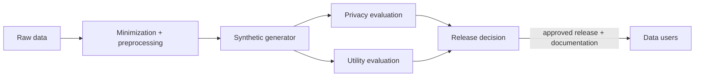

# Synthetic Data Release Pipeline

## Goal

Release data-like artifacts while reducing privacy risk and preserving enough utility for intended downstream tasks.

## Actors

Data owner, synthetic-data generator, privacy reviewer, utility evaluator, release approver, data users, and auditor.

## Data Flow

## Trust Boundaries

| Boundary | What crosses | Who can see it | Risk |
| --- | --- | --- | --- |
| Raw data to preprocessing | Sensitive records | Data owner, processor | Unnecessary sensitive fields retained |
| Generator to evaluators | Synthetic candidates | Privacy and utility reviewers | Candidate selection can leak or overfit |
| Evaluation to release approver | Test results and caveats | Approver | Utility pressure weakens privacy |
| Release to users | Synthetic dataset and documentation | Data users | Misuse or overtrust |

## Assumptions

- Intended uses are defined before generation.
- Privacy tests include memorization and membership inference.
- DP claims include parameters and accounting when DP is used.
- Failed candidate releases are tracked.

## PET Stack

Synthetic data generation, optional DP, minimization, memorization tests, nearest-neighbor audits, downstream utility benchmarks, and release governance.

## What This Does Not Protect Against

- Memorization by non-DP generators.
- Misuse outside intended tasks.
- Utility loss for rare groups.
- Auxiliary information attacks not tested.
- Overclaiming "anonymous" status.

## Deployment Notes

Publish a release card with intended uses, prohibited uses, privacy tests, utility tests, residual risks, and contact path for issues.

## Tradeoffs

More privacy usually reduces fidelity. More tuning for utility can consume privacy budget or increase memorization risk.

## Failure Modes

Rare-record copying, weak downstream utility, undocumented DP parameters, auxiliary releases that break the claim, and users treating synthetic data as ground truth.

## Evaluation Checklist

- Is the release DP? If yes, what parameters?
- What memorization tests were run?
- What downstream tasks were benchmarked?
- Are rare groups evaluated separately?
- Are intended and prohibited uses documented?
