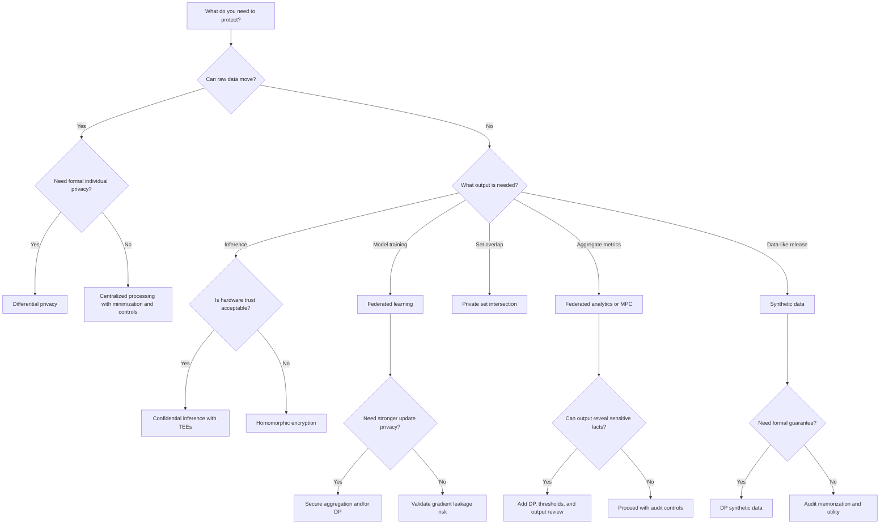

# Decision Tree

```mermaid
flowchart TD
  A[What do you need to protect?] --> B{Can raw data move?}
  B -->|Yes| C{Need formal individual privacy?}
  B -->|No| D{What output is needed?}
  C -->|Yes| E[Differential privacy]
  C -->|No| F[Centralized processing with minimization and controls]
  D -->|Model training| G[Federated learning]
  D -->|Aggregate metrics| H[Federated analytics or MPC]
  D -->|Set overlap| I[Private set intersection]
  D -->|Inference| J{Is hardware trust acceptable?}
  D -->|Data-like release| K[Synthetic data]
  J -->|Yes| L[Confidential inference with TEEs]
  J -->|No| M[Homomorphic encryption]
  G --> N{Need stronger update privacy?}
  N -->|Yes| O[Secure aggregation and/or DP]
  N -->|No| P[Validate gradient leakage risk]
  H --> Q{Can output reveal sensitive facts?}
  Q -->|Yes| R[Add DP, thresholds, and output review]
  Q -->|No| S[Proceed with audit controls]
  K --> T{Need formal guarantee?}
  T -->|Yes| U[DP synthetic data]
  T -->|No| V[Audit memorization and utility]
```

## How To Use It

Treat the result as a first candidate, not a final answer. The next step is to write the threat model and identify what the chosen output still reveals.
