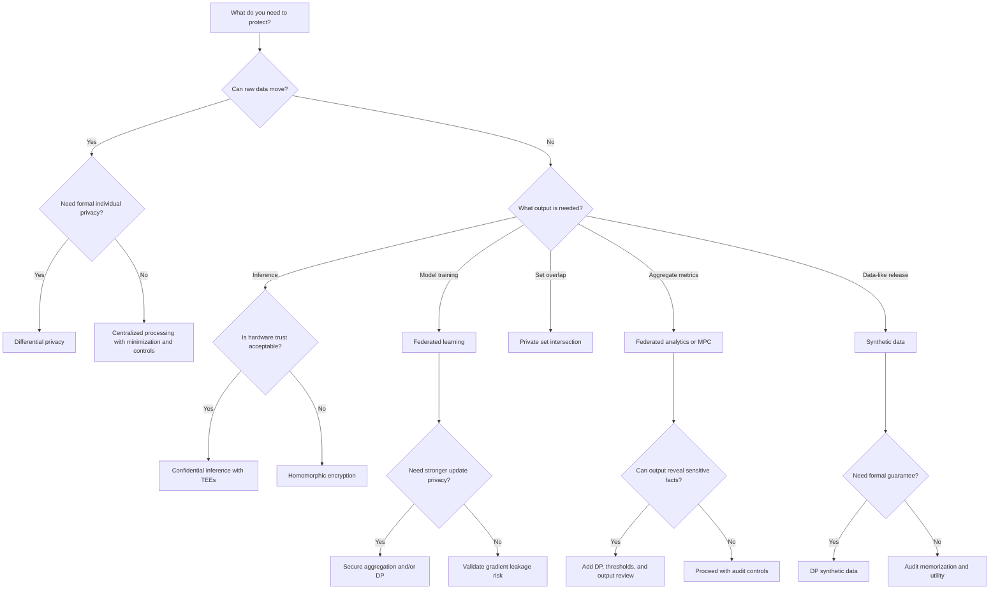

# Decision Tree

## How To Use It

Treat the result as a first candidate, not a final answer. The next step is to write the threat model and identify what the chosen output still reveals.

## Follow The Decision

- Differential privacy: [PET taxonomy](../start-here/pet-taxonomy.md#differential-privacy), [DP synthetic data release](../pet-patterns/dp-synthetic-data-release.md), [DP research problems](../fix-my-itch/differential-privacy.md)
- Federated learning: [Cross-silo federated learning](../pet-patterns/cross-silo-federated-learning.md), [FL secure aggregation](../pet-architectures/fl-secure-aggregation.md), [FL research problems](../fix-my-itch/federated-learning.md)
- MPC: [MPC analytics pipeline](../pet-architectures/mpc-analytics-pipeline.md), [MPC research problems](../fix-my-itch/mpc.md), [Collusion](../threat-models/collusion.md)
- Homomorphic encryption: [Private inference](../pet-patterns/private-inference.md), [HE private inference API](../pet-architectures/he-private-inference-api.md), [HE research problems](../fix-my-itch/homomorphic-encryption.md)
- TEEs: [Confidential inference](../pet-patterns/confidential-inference.md), [Confidential RAG](../pet-architectures/confidential-rag.md), [Side channels](../threat-models/side-channels.md)
- Synthetic data: [DP synthetic data release](../pet-patterns/dp-synthetic-data-release.md), [Synthetic data release pipeline](../pet-architectures/synthetic-data-release-pipeline.md), [Synthetic data research problems](../fix-my-itch/synthetic-data.md)
