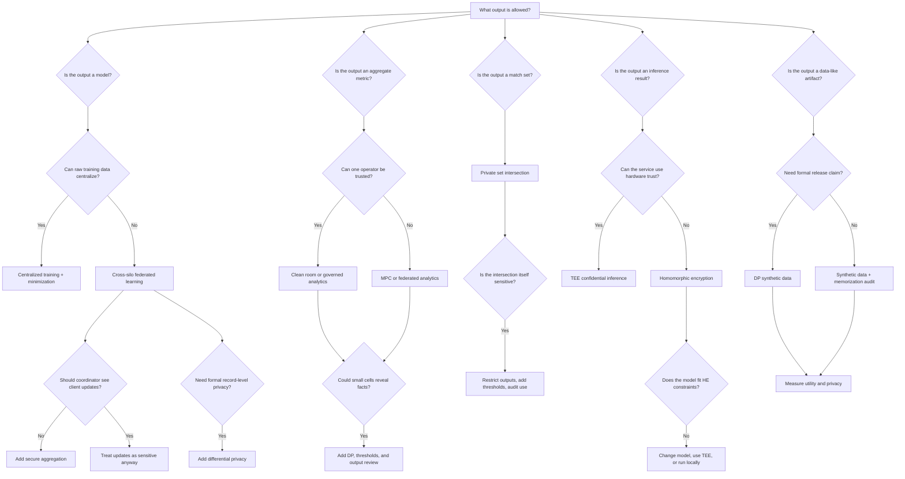

# Decision Tree

This tree gives a first candidate, not a final architecture. Use it to avoid obvious mismatches, then validate the recommendation with a threat model and workload benchmark.

## How To Read The Tree

1. Start with the allowed output. Most privacy failures happen after the PET successfully protects inputs.
2. Mark every artifact that still moves: updates, embeddings, identifiers, prompts, logs, metrics, model weights, and final outputs.
3. Add the adversary: curious coordinator, malicious participant, colluding parties, platform operator, inference attacker, side-channel attacker, or external attacker.
4. Write the reversal condition: the result that would make you pick a different PET.

## When The Recommendation Changes

| First answer | Change recommendation when... | Consider instead |
| --- | --- | --- |
| Federated learning | Participants cannot run local training or the task is only aggregate measurement | Federated analytics, MPC, clean room |
| Secure aggregation | You need to inspect individual updates for debugging or poisoning defense | Robust aggregation, trusted review, staged rollout |
| Differential privacy | Utility collapses at a defensible budget | Narrower release, larger cohorts, fewer queries, governance controls |
| MPC | Parties cannot maintain protocol operations or collusion assumptions are unrealistic | Clean room, TEE, centralized governed processing |
| HE | Latency, ciphertext size, or unsupported operators break the workload | TEE confidential inference, client-side inference, model redesign |
| TEE | Hardware trust, attestation, or side-channel assumptions are unacceptable | HE, MPC, local execution, governance-only design |
| PSI | Revealing the match set is not allowed | MPC for downstream aggregate, DP counts, no-release workflow |
| Synthetic data | Memorization risk is high or downstream utility is poor | DP query access, restricted release, task-specific benchmark data |

## Worked Example: Hospitals Training A Model

Path through the tree:

1. Output is a model.
2. Raw training data cannot centralize.
3. Start with cross-silo FL.
4. Coordinator should not inspect hospital updates, so add secure aggregation.
5. Patient-level contribution should be bounded, so evaluate DP.

Recommended shortlist: **FL + secure aggregation + optional DP**, with robust aggregation and per-site evaluation.

What can go wrong:

- FL updates leak information if secure aggregation or DP assumptions fail.
- DP utility may be unacceptable for rare conditions.
- Non-IID data can produce a model that works for large hospitals and fails at small ones.
- Poisoned updates are harder to detect when update visibility is reduced.

Measure before launch: per-site performance, subgroup performance, privacy budget, minimum participants per round, dropout behavior, poisoning resilience, and operational cost.

## Worked Example: Private Inference

Path through the tree:

1. Output is an inference result.
2. The service should not see plaintext inputs.
3. Hardware trust is acceptable only if customers can verify attestation.
4. If the model is large or latency-sensitive, start with TEE confidential inference.
5. If hardware trust is unacceptable and the model is HE-friendly, benchmark HE.

Recommended shortlist: **TEE first for broad model support; HE only after model-fit benchmarking**.

What can go wrong:

- The output reveals the sensitive attribute the input protection was meant to hide.
- Attestation is not integrated into the client workflow.
- HE operator constraints force a model that is not useful.
- Logs capture plaintext prompts or decrypted outputs.

## Follow The Decision

- Differential privacy: [PET taxonomy](../start-here/pet-taxonomy.md#differential-privacy), [DP synthetic data release](../pet-patterns/dp-synthetic-data-release.md), [DP research problems](../fix-my-itch/differential-privacy.md)
- Federated learning: [Cross-silo federated learning](../pet-patterns/cross-silo-federated-learning.md), [FL secure aggregation](../pet-architectures/fl-secure-aggregation.md), [FL research problems](../fix-my-itch/federated-learning.md)
- MPC: [MPC analytics pipeline](../pet-architectures/mpc-analytics-pipeline.md), [MPC research problems](../fix-my-itch/mpc.md), [Collusion](../threat-models/collusion.md)
- Homomorphic encryption: [Private inference](../pet-patterns/private-inference.md), [HE private inference API](../pet-architectures/he-private-inference-api.md), [HE research problems](../fix-my-itch/homomorphic-encryption.md)
- TEEs: [Confidential inference](../pet-patterns/confidential-inference.md), [Confidential RAG](../pet-architectures/confidential-rag.md), [Side channels](../threat-models/side-channels.md)
- Synthetic data: [DP synthetic data release](../pet-patterns/dp-synthetic-data-release.md), [Synthetic data release pipeline](../pet-architectures/synthetic-data-release-pipeline.md), [Synthetic data research problems](../fix-my-itch/synthetic-data.md)
